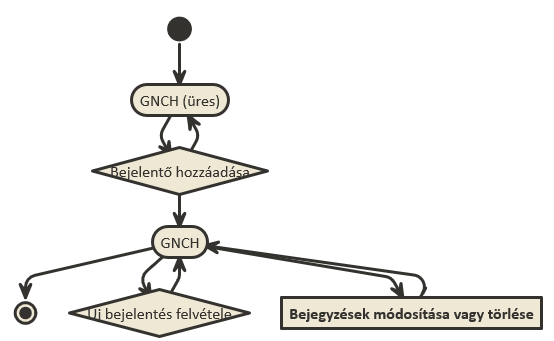
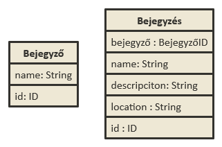
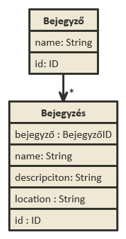

# GroupNote Hibabejelentő szolgáltatás 
######Fejlesztők számára

- ELTE IK - Alkalmazások Fejelsztése - II. (kötelező) beadandó
- JJ8O3E - Fazekas Bálint (@Woaf)

#Követelményanalízis
 - Funkcionális követelmények:
  * Kezelők felvétele
  * Kezelők hozzárendelése bejelentésekhez (egy bejelentés tartalmaz: nevet, leírást, és helyszínt)
  * A bejelentett panaszokat lehessen módosítani,
  * illetve törölni

 - Nem funkcionális követelmények:
  * Könnyű kezelhetőség; egyszerű felület (ergonomikus weboldal)

 - Használati eset modell
  * Szerepkörök:
    1. Bejelentést kezelő személy:
      - Új kezelő hozzáadása
      - Új bejelentés hozzáadása
      - Már meglévő bejelentések módosítása,
      - avagy törlése
  
  * 
  
##Tervezés
 - Architektúra terv
    * Oldaltérkép (lásd az előző diagramon)
        -Bejegyzések oldala:
           + Új bejelentő (kezelő)
           + Bejelentés módosítása,
           + vagy törlése
	  * Oldaltervek
	    - 
	 
 - Osztálymodell
    * Adatmodell
    
      

    * Adatbázisterv
    
      
      
##Felhasználói dokumentáció
This README outlines the details of collaborating on this Ember application.
A short introduction of this app could easily go here.

## Prerequisites

You will need the following things properly installed on your computer.

* [Git](http://git-scm.com/)
* [Node.js](http://nodejs.org/) (with NPM)
* [Bower](http://bower.io/)
* [Ember CLI](http://www.ember-cli.com/)
* [PhantomJS](http://phantomjs.org/)

## Installation

* `git clone <repository-url>` this repository
* change into the new directory
* `npm install`
* `bower install`

## Running / Development

* `ember server`
* Visit your app at [http://localhost:4200](http://localhost:4200).

### Code Generators

Make use of the many generators for code, try `ember help generate` for more details

### Running Tests

* `ember test`
* `ember test --server`

### Building

* `ember build` (development)
* `ember build --environment production` (production)

### Deploying

Specify what it takes to deploy your app.

## Further Reading / Useful Links

* [ember.js](http://emberjs.com/)
* [ember-cli](http://www.ember-cli.com/)
* Development Browser Extensions
  * [ember inspector for chrome](https://chrome.google.com/webstore/detail/ember-inspector/bmdblncegkenkacieihfhpjfppoconhi)
  * [ember inspector for firefox](https://addons.mozilla.org/en-US/firefox/addon/ember-inspector/)

